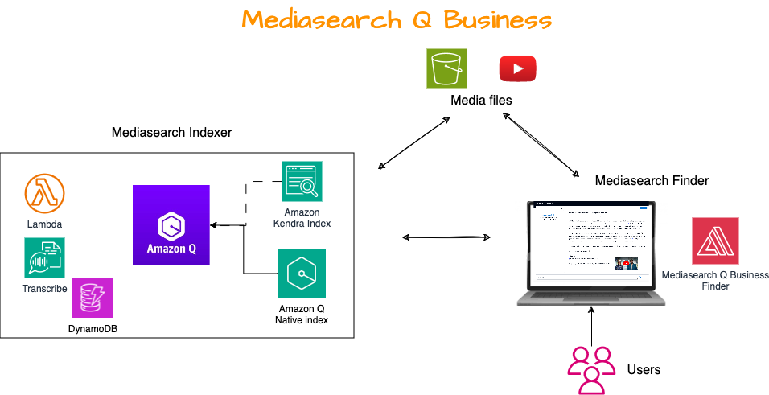
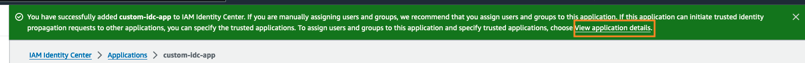

# MediaSearch Q Business Solution

In today's digital landscape, the demand for audio and video content is skyrocketing. Organizations are increasingly leveraging media to engage with their audiences in innovative ways. From product documentation in video format to podcasts replacing traditional blog posts, content creators are exploring diverse channels to reach a wider audience. The rise of virtual workplaces has also led to a surge in content captured through recorded meetings, calls, and voicemails. Additionally, contact centers generate a wealth of media content, including support calls, screen share recordings, and post-call surveys.
This solution makes audio and video media content searchable in an Amazon Q Business Index. Amazon Q Business offers 2 types of retrievers to customers. Amazon Q Native retriever and Kendra retriever.

**Note:** After you have set up an Amazon Q Business application using either a Native or a Kendra retriever, it's not possible to switch between these two retriever types using the solution. The initial choice of retriever is permanent for the Amazon Q Business application.

The solution allows customers to index media files from s3 buckets on YouTube Playlists.



## Getting started

See the blog post to get started: [Enhance your Media search experience using Amazon Q Business and Amazon Transcribe](https://aws.amazon.com/blogs/machine-learning/enhance-your-media-search-experience-using-amazon-q-business-and-amazon-transcribe/)


## Configuring the AWS IAM Identity Centre Application

When the Identity Centre instance is in the same account where you are deploying the Mediasearch Q Business solution, The Finder stack allows you to auto-create the AWS Identity Center customer managed application as part of the stack deployment. The steps involved are explained in the Mediasearch Q Business blog.
If you use the Organization instance of IAM Identity Center enabled in your management account, then you will be deploying the Mediasearch Q Business Finder stack in a different AWS account. In this case follow the below steps to create an Identity Centre Application manually.

1. After the successful completion of the stack, Navigate to [Identity center Applications](https://console.aws.amazon.com/singlesignon/applications/home?#/instances/) and click on **Add Application**. 
2. In setup preference, select **I have an application I want to set up**. Keep **OAuth 2.0** selected and click **Next**.
3. For **Display name**, Enter a name of the application followed by a **Description**.
    * For User and group assignment method, keep **Require Assignments** selected.
    * Select **Not Visible** for the Application visibility in the **AWS access portal**. 
    * Click on **Next**.
4. In the **Authentication with trusted token issuer** screen, we first have to create a trusted token issuer. Click on the **Create trusted token issuer** button.
    * For the Issuer URL. copy the Output value of Key **CognitoTokenSigningURL** from the Finder stack
    * Enter a name for **Trusted token issuer name**.
    * Update the Map Attributes as appropriate. In this example we will leave the **Identity Provider attribute**, *Email(email)* mapped to the **Identity Center attribute**, *Email*
    * Click on **Create trusted token issuer**
5. Once the trusted token issuer has been created, select the created trusted token issuer on the **IDC Application>Authentication with trusted token issuer** section.
6. Next, set the value for the aud claim defined in the JWT as the Cloudformation output value for Key, **UserPoolClientId**.
7. Optionally select the checkbox, **Automatically refresh user authentication for active application sessions** to automatically request a new access token to refresh user authentication. Click on Next.
8. In the Specify application credentials, select the **Edit the application policy** and enter the following Policy and click on Next.
```
    {
        "Version": "2012-10-17",
        "Statement": [
            {
            "Effect": "Allow",
            "Principal": {
                "Service": "lambda.amazonaws.com"
            },
            "Action": [
                "sso-oauth:CreateTokenWithIAM"
            ],
            "Resource": [
                "*"
            ]
            }
        ]
    }
```
9. Click **Submit**. Once submitted, on the success banner that appears on top, click on View application details to navigate to the IDC Application created.



10. On the **Trusted applications for identity propagation**, click on **Specify trusted applications**:
    * On the setup type, select **All applications for service with same access** and click **Next**
    * Select the checkbox for **Amazon Q** and click **Next**.
    * On this step, review configuration and click on **Trust applications**.
11. Copy the Identity Ceter Application ARN, and navigate to the Cloudformation console, and select the Mediasearch Q Business finder stack and click on **Update**.
12. Enter the copied ARN into the **IdentityCenterApplicationArn** parameter of Cloudformation template. Click on Next and then Update to Update the Q Business Finder stack.

## Add Transcribe options
You can add transcribe options - additional configuration settings to customise your media file transcription job - using a transcribe options file. Each transcribe options file is associated with an indexed media file.  Adding transribe options allows you to take full advantage of Amazon Transcribe features, such as [Custom vocabularies](https://docs.aws.amazon.com/transcribe/latest/dg/how-vocabulary.html), [Automatic content redaction](https://docs.aws.amazon.com/transcribe/latest/dg/content-redaction.html), [Custom Language models](https://docs.aws.amazon.com/transcribe/latest/dg/custom-language-models.html), and more. 

Following the same convention as Kendra metadata, your transcribe options files must be stored in the same bucket as your media files. You can specify a location within the bucket for your options files using the optional CloudFormation parameter `OptionsFolderPrefix`. If you don't specify an S3 prefix, your options files must be stored in the same location as your indexed documents. An options file must have the same name as the associated media file, with the additional filename suffix `.transcribeopts.json` added. 

Transcribe options files must contain valid JSON to provide one or more Transcribe job parameters - see [Amazon Transcribe Request Parameters](https://docs.aws.amazon.com/transcribe/latest/dg/API_StartTranscriptionJob.html#transcribe-StartTranscriptionJob-request-TranscriptionJobName) for valid parameters and syntax. Here is an example options file which specifies that the associated media file should be transcribed using the (preconfigured) custom vocabulary `MyCustomVocab`:
```
{
        "LanguageCode": "en-US",
        "Settings":{
                "VocabularyName":"MyCustomVocab"
        }
}
```

The values for `TranscriptionJobName` and `Media` are provided automatically by the crawler, and will not be overwritten by the options file.  
  
If the options file does not specify a value for `LanguageCode`, the crawler will automatically set `IdentifyLanguage` to `true`, allowing Transcribe to automatically determine the language used in the media file. You must provide a value for `LanguageCode` when you use a custom vocabulary, a custom model, or vocabulary filter. 
  
To troubleshoot any issues with transcribe options, examine the crawler lambda function logs in CloudWatch. On the Functions page of the Lambda console, use your MediaSearch stack name as a filter to list the two MediaSearch indexer functions. Choose the crawler function, and then choose **Monitor & View logs in CloudWatch** to examine the output and troubleshoot any issues reported when starting the Transcribe jobs for your media files.

## Indexer

To download audio for the YouTube videos, the Indexer uses the [yt-dlp](https://github.com/yt-dlp/yt-dlp) python package. The yt_dlp package is installed into the `layers/yt_dlp` folder and uploaded as a Lambda Layer. Additionally the YouTube Indexer, Indexer, crawler and jobcomplete lambda function code are maintained in the `lambda` directory.

## Finder

The Finder application is based on the Kendra sample search application, and is in the `finderapp` directory. It is built during deployment as an Amplify Console application. The initial application build and deployment takes about 10 minutes.  
  
If the application doesn’t open within 10-15 minutes after deploying the Finder stack, then you troubleshoot the problem: 
- Open AWS Amplify in the AWS console
- Choose the MS-Finder-QBusiness-App
- Click on the failed step - Provision, Build, Deploy, or Verify. For example, choose `Build`, then `FrontEnd` to explore the application build logs and identify the problem. 

## CloudFormation Templates

The `cfn-templates` directory contains CloudFormation templates used to deploy the MediaSearch Q Business Indexer and Finder applications
- msindexer-qbusiness.yaml: Deploys an indexer for all files, a YouTube indexer to index and download audio for YouTube files, including (optionally) a Kendra index, a DynamoDB table to keep track of the state of media files, a DynamoDB table to keep track of YouTube videoid and their metadata, Lambda functions, IAM roles, EventBridge Events etc.
- msfinder-qbusiness.yaml: Deploys the finder web application using AWS Amplify, including a CodeCommit repository, an AWS Amplify console application, and IAM roles
The templates contain tokens for bucket names, zipfile names, etc. The publish scipt, publish.sh, is used to replace these tokens and deploy templates and code artifacts to a deployment bucket


## Build and Publish MediaSearch

Use the [publish.sh](./publish.sh) bash script to build the project and deploy cloud formation templates to your own deployment bucket. 

Prerequisite: You must already have the [AWS CLI](https://docs.aws.amazon.com/cli/latest/userguide/cli-chap-install.html) installed and configured, or use an AWS Cloud9 environment.

To deploy to non-default region, set environment variable `AWS_DEFAULT_REGION` to a region supported by Amazon Kendra and Amazon Transcribe. See: [AWS Regional Services](https://aws.amazon.com/about-aws/global-infrastructure/regional-product-services/) 
E.g. to deploy in Ireland run `export AWS_DEFAULT_REGION=eu-west-1` before running the publish script.

Run the script with up to 6 parameters:
```
./publish.sh cfn_bucket cfn_prefix [public] [dflt_media_bucket] [dflt_media_prefix] [dflt_metadata_prefix] [dflt_options_prefix]

- cfn_bucket: name of S3 bucket to deploy CloudFormation templates and code artifacts. if bucket does not exist it will be created.
- cfn_prefix: artifacts will be copied to the path specified by this prefix (path/to/artifacts/)
- public (Optional): If ACL is enabled and Public access is allowed on your cfn_bucket then the uploaded deployment artefacts are made public.
- dflt_media_bucket: (Optional) sets the default media bucket in the template.. for example, use this default installations to index sample files in the bucket you provide. Must be in same region as cfn_bucket.
- dflt_media_prefix: (Optional) default path to (sample) media files in the dflt_media_bucket. If not mentioned is set to artifacts/mediasearch/sample-media/
- dflt_metadata_prefix: (Optional) default prefix for (sample) Kendra metadata files in the dflt_media_bucket.  If not mentioned is set to artifacts/mediasearch/sample-metadata/
- dflt_options_prefix: (Optional) default prefix for (sample) Transcribe options files in the dflt_media_bucket
```

It uses `aws cloudformation package` to create and upload artefacts like layers, lambda code and finally the cloudformation templates(``msindexer-qbusiness.yaml`` and ``msfinder-qbusiness.yaml``) that references the code arteacts to s3 bucket.
When complete, it displays the URLS for the CloudFormation templates and 1-click URLs for launching the stack create in CloudFormation , e.g.:
```
Outputs
MSINDEXER-QBUSINESS Template URL - https://roshans-artefacts.s3.us-east-1.amazonaws.com/localfix/msindexer-qbusiness.yaml

MSINDEXER-QBUSINESS CF Launch URL - https://us-east-1.console.aws.amazon.com/cloudformation/home?region=us-east-1#/stacks/create/review?templateURL=https://roshans-artefacts.s3.us-east-1.amazonaws.com/localfix/msindexer-qbusiness.yaml&stackName=MediaSearch-MSINDEXER-QBUSINESS

MSFINDER-QBUSINESS Template URL - https://roshans-artefacts.s3.us-east-1.amazonaws.com/localfix/msfinder-qbusiness.yaml

MSFINDER CF Launch URL - https://us-east-1.console.aws.amazon.com/cloudformation/home?region=us-east-1#/stacks/create/review?templateURL=https://roshans-artefacts.s3.us-east-1.amazonaws.com/localfix/msfinder-qbusiness.yaml&stackName=MediaSearch-MSFINDER-QBUSINESS
Done
```

If you specify a value for dflt_media_bucket and it is in a different AWS region than the cfn_bucket, the script will display a warning, e.g.:
```
WARNING!!! Default media bucket region (us-east-1) does not match deployment bucket region (eu-west-1).. Media bucket (roshans-dflt_media_bucket) must be in same region as deployment bucket (roshans-cfn_bucket)
```
If you see this warning, run the publish script again with different buckets, to resolve the problem. If you deploy a stack using a media bucket in a region other than the region you deploy in, your media files will not be transcribed or indexed.

## Learn More

See the [blog post](https://aws.amazon.com/blogs/machine-learning/enhance-your-media-search-experience-using-amazon-q-business-and-amazon-transcribe/) for much more information, including:
- How to easily deploy MediaSearch Q Business using publically published templates and sample files in us-east-1
- Cost information
- Tutorial for getting started and testing with the sample files
- How to monitor and troubleshot problems

## Contribute

Fork the MediaSearch Q Business GitHub repository, enhance the code, and send us pull requests so we can incorporate and share your improvements!
Here are a few suggestions for features you might want to implement:
- Improve transcription accuracy for your media domain by adding support for Amazon Transcribe domain specific custom language models or custom vocabulary.
- Enhance your search using filters and facets by adding support for Kendra metadata, or go a step further by integrating Amazon Comprehend to automatically create filters and facets using detected entities as illustrated in this great blog post:  Build an intelligent search solution with automated content enrichment.

We’d love to hear from you. Let us know what you think using the repo issues forum. 